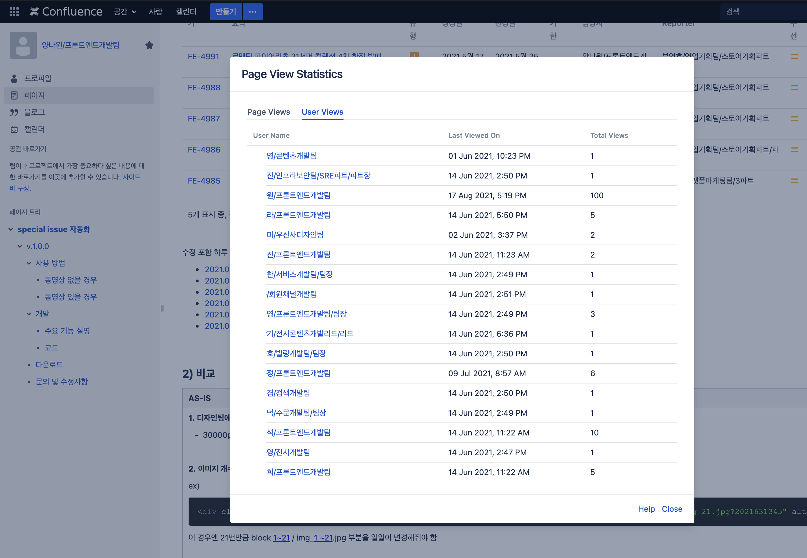

# 스페셜 이슈 자동화 프로그램  
무신사 스페셜 이슈 페이지 작업 효율을 높여주는 자동화 프로그램  

# Description  
팀 내 업무 효율성 높이기 위해 스페셜이슈 자동화 프로그램을 개발했습니다. 드래그를 통해 위치값을 자동으로 계산하도록 개발하여 작업 속도를 개선했습니다. 관련된 자세한 내용은 [기술블로그](https://yangnawon.com/tech/0)에 작성해두었습니다.  
| 비교 | AS-IS | TO-BE | 결과 |
|:--------:|:--------:|:--------:|:----:|
| 시간 | 30분 소요 | 5분 소요 | 시간 80% 감소 |
| 효율 | 각 a태그의 top,margin-left 값을 잡아줘야 함 | 드래그로 위치를 css코드로 자동 변환 | 같은 업무를 하시는 동료분과 함께 사용중 
  
현재(2021.05) MUSINSA wiki에 개발 과정과 사용 방법을 작성해두어 사내 공유 중입니다.  

  
## How to use 
> 상업적 목적으로 개발된 소프트웨어가 아닌 사내 자동화 프로그램으로, 현재는 사용이 불가능합니다.
## 1. 드래그로 a 태그 위치값 자동 계산 (반응형 고려)

    
  
- 반응형과 OS 환경을 고려했기 때문에 한번의 실행으로 하나의 페이지 작업이 가능합니다.  
- 작업할 이미지를 불러오면, 입력과 동시에 이미지의 개수와 크기를 계산하도록 구성했습니다.  
- a 태그를 작업할 위치를 드래그해주면, 해당 이미지 크기의 비율에 맞게 a 태그의 위치가 계산됩니다.  

## 2. HTML/CSS 코드 자동 생성 및 저장, 미리 보기 기능 제공  

    
  
-  저장하기 버튼을 누르면 HTML/CSS/JS 코드가 자동 생성됩니다.  
-  미리보기 버튼을 누르면 결과물 확인이 가능합니다.    
  
# Stack
Python, OpenCV, PyQt5  

# Release Note
**2021.06.10**
- [01. 이미지 파일명 img로 저장할 수 있게 변경](https://github.com/ynawhocodes/self-perish-project/commit/92e561607eea7833bb82b38d2eea80e43fde880e)
- [02. 링크 들어가는 이미지 높이 측정방법 변경](https://github.com/ynawhocodes/self-perish-project/commit/92e561607eea7833bb82b38d2eea80e43fde880e): 
  - **[AS-IS]** 폴더 열 때 첫번째 이미지 높이 크기 측정 **[TO-BE]** style 잡을 때 url있는 이미지 높이 크기 측정
  -  링크 있는 이미지의 높이 크기가 필요하기 때문
- [03. label 과 entry 위치 변경]( https://github.com/ynawhocodes/self-perish-project/commit/f63d572bae7e4311aebce5b098bbc97eab245584)

**2021.06.11**
- [04. 이벤트 영역 코드 구분](https://github.com/ynawhocodes/self-perish-project/commit/743e138af0d9a00f10b2875ee9c3cd6ab427c7c4)
- [05. html 파일 상위 디렉토리에 저장되도록 변경](https://github.com/ynawhocodes/self-perish-project/commit/a66c35b3cf30e6c5d5c924ecbbb2a469ff41d8cb)
- [06. 이미지별로 높이 구하도록 개선](https://github.com/ynawhocodes/self-perish-project/commit/ab025988c773e7c2e24889b6f9b52698c1239bf1): 30000px 대비, 자유자재로 이미지 분할을 위해

**2021.07.30**  
- [07. Mac, Window OS 환경에 맞는 유동적인 사이즈로 변경](https://github.com/ynawhocodes/self-perish-project/commit/e038cced6eca03783dc95d7b3552cc336000b0c3#diff-cd574a4dd7cb32d211de888a2f0055fcc1a55aacfc92d042587480ab2fddee4e)

**2021.08.17**
- [08. Mac 버전 개발 완료](https://github.com/ynawhocodes/self-perish-project/commit/51d8d8b95166a7cd99995e14e9acf75e98b5af18)
   
**2021.12.27**
- [디자인 변경에 따른 동영상 비율 수정, 본문과 이벤트 코드 분리](https://github.com/ynawhocodes/self-perish-project/commit/62f97493e2c346a47515467347aaeebd4e601a2a#diff-cd574a4dd7cb32d211de888a2f0055fcc1a55aacfc92d042587480ab2fddee4e)

**2022.02.04**
- [파일명 읽는 방법 변경](https://github.com/ynawhocodes/self-perish-project/commit/0c926a34021c0ab8d124988a06f8253d2d59e59b)  
  - **[AS-IS]** 이미지 파일명 자동 변경 **[TO-BE]** 이미지 파일명 그대로 입력받도록 함
  - 파일명 자동변경이 된 파일들을 다시 읽어오는 경우 같은 이름으로 변경되기 때문에 오류가 남. 이 때문에 지금까지 파일 삭제하고 포토샵에서 다시 파일 저장해왔는데 이 번거로움을 줄이기 위함  

**2022.02.07**
- [os.listdir의 파일 정렬 문제 해결](https://github.com/ynawhocodes/self-perish-project/commit/0a561dedddf53f2e7f30cb099591daf71e790e96)
  - mac에서도 사용할 수 있도록 파일 정렬 방법을 통일 시킴 

**2022.03.02**  
- [mac용 파일명 자동 변경되는 버전 추가로 개발](https://github.com/ynawhocodes/self-perish-project/commit/b9f424cf479f5acea4e429a69a6731604edda5d1)  
  - 함께 쓰는 직원분들 요청으로 파일명 변경 버전 추가로 개발

